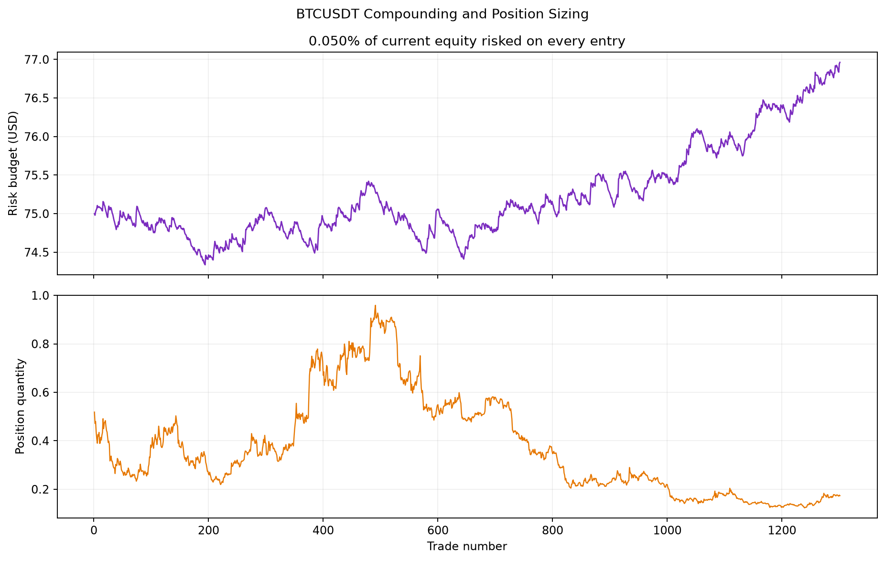
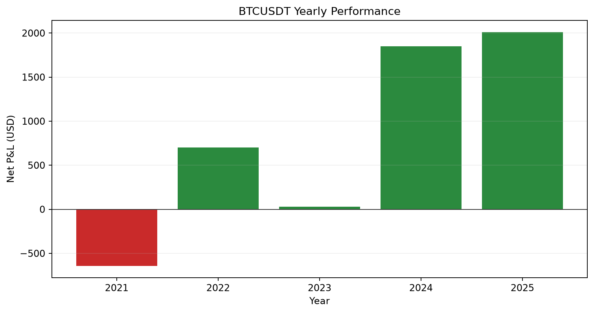

# BTCUSDT London Dynamic Breakout

[](https://www.python.org/)


A reproducible Python research project testing a dynamic London-session momentum breakout on five years of public BTCUSDT one-minute data. It includes an event-driven backtester, checksum-verified data downloads, equity-based position sizing, automated tests, full trade records, and presentation-ready analytics.

> Educational portfolio project—not investment advice or evidence of executable live performance.

## Results

| Metric | Result |
|---|---:|
| Period | 1 Jan 2021 – 1 Jan 2026 |
| Starting equity | $150,000.00 |
| Ending equity | $153,944.59 |
| Total return | **+2.63%** |
| CAGR | +0.52% |
| Maximum drawdown | **-1.34%** |
| Sharpe ratio (0% RF) | 0.62 |
| Trades | 1,301 |
| Win rate | 39.35% |
| Profit factor | 1.11 |


## Strategy

- Recalculate the previous 60 completed one-minute candles' high and low during 08:00–11:00 London time.
- Trigger a long above the rolling high or a short below the rolling low.
- Allow one trade per London day and cancel the opposite side after entry.
- Risk exactly **0.05% of current equity** at the initial stop on every entry.
- Use a 0.5%-of-entry initial and trailing stop, with no take-profit.
- Close any surviving position at 16:00 London.
- Skip candles where both entry directions trigger and their sequence cannot be known.

## Compounding position sizing

```text
risk budget = current equity × 0.0005
quantity    = risk budget ÷ stop distance
```

The first trade risks $75.00. As equity changes, every subsequent risk budget is recalculated; it reaches approximately $76.96 near the end. BTC quantity can fall while the risk budget rises because a higher BTC price produces a larger dollar stop distance. This is percentage-risk scaling, not fixed-lot sizing.



Increasing risk from 0.02% to 0.05% scaled the five-year result from approximately +1.05% return / -0.54% maximum drawdown to +2.63% / -1.34%. It increases both return and drawdown; it does not improve the underlying trading edge.

## Annual performance

| Year | Trades | Net P&L | Win rate |
|---:|---:|---:|---:|
| 2021 | 259 | -$642.61 | 32.43% |
| 2022 | 260 | +$701.37 | 39.62% |
| 2023 | 259 | +$27.57 | 37.45% |
| 2024 | 262 | +$1,848.01 | 44.27% |
| 2025 | 261 | +$2,010.24 | 42.91% |



## Repository structure

```text
├── notebooks/              # Portfolio analysis notebook
├── results/                # Charts, trades, equity and summary metrics
├── scripts/                # Checksum-verified Binance downloader
├── src/fx_backtest/        # Backtest engine and data validation
├── tests/                  # Position-sizing, session and data tests
└── pyproject.toml          # Reproducible Python environment
```

## Reproduce

```powershell
python -m venv .venv
.venv\Scripts\Activate.ps1
python -m pip install -e ".[dev]"
python scripts/download_binance_m1.py
python -m fx_backtest.independent_breakout --symbols BTCUSDT --risk-percent 0.05 --output reproduced_results
pytest -q
```

Raw market archives are intentionally excluded from GitHub. The download script retrieves the same Binance monthly archives and validates every SHA-256 checksum.

## Limitations

The study deliberately sets fees, spread, slippage and financing to zero. One-minute OHLC bars cannot reconstruct the exact intraminute price path, so the engine applies conservative stop handling and skips dual-entry ambiguity. The positive return is modest and should not be presented as proof of a production-ready strategy.

## Résumé bullet

Built a Python event-driven BTCUSDT breakout backtester over five years of one-minute Binance data, implementing London-time session handling, equity-based 0.05% risk sizing, dynamic entries, trailing stops, ambiguity controls, automated tests, and reproducible performance reporting across 1,301 simulated trades.

