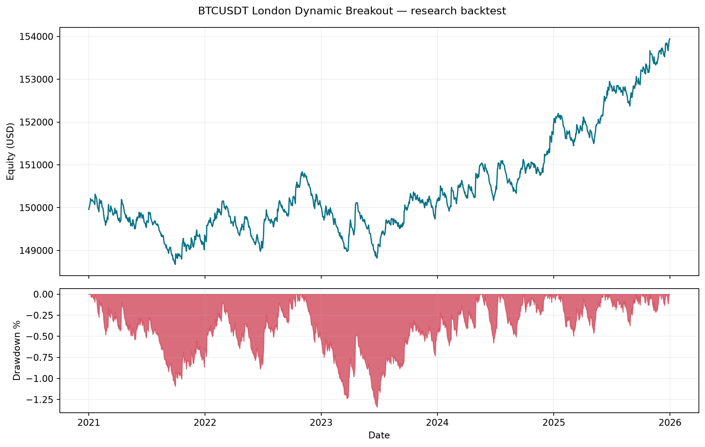

# BTCUSDT London Volatility Breakout

Python backtest of a rolling one-hour breakout during the London session.

## What it does

- Reads BTCUSDT one-minute Binance candles.
- Updates breakout levels every minute.
- Takes one trade per London weekday.
- Risks 0.05% of current equity per entry.
- Uses a 0.5% initial and trailing stop.
- Closes open trades at 16:00 London.
- Produces trades, equity, drawdown and yearly results.

## Result

Test period: 1 January 2021 to 1 January 2026. Starting equity: $150,000.

| Metric | Value |
|---|---:|
| Ending equity | $153,944.59 |
| Total return | 2.63% |
| CAGR | 0.52% |
| Maximum drawdown | -1.34% |
| Sharpe ratio | 0.62 |
| Trades | 1,301 |
| Win rate | 39.35% |
| Profit factor | 1.11 |



## Rules

```text
08:00–11:00 London
buy stop  = previous 60 completed candles' high
sell stop = previous 60 completed candles' low
risk      = current equity × 0.05%
stop      = entry price × 0.5%
exit      = trailing stop or 16:00 London
```

Position size is recalculated for every trade:

```text
quantity = risk budget / stop distance
```

This is equity scaling. It is not a fixed BTC quantity.

| Risk per trade | Return | Maximum drawdown |
|---:|---:|---:|
| 0.02% | 1.05% | -0.54% |
| 0.05% | 2.63% | -1.34% |

Increasing risk changed the size of the result. It did not improve the strategy edge.

## Structure

```text
BTCUSDT-London-Volatility-Breakout/
├── README.md
├── strategy.py
├── backtest.ipynb
├── config/
│   └── params.yaml
├── data/                  # ignored by Git
├── results/               # generated reports
├── tests/
└── requirements.txt
```

## Run

```powershell
python -m venv .venv
.venv\Scripts\Activate.ps1
pip install -r requirements.txt
python strategy.py
```

Open [backtest.ipynb](backtest.ipynb) for the analysis.

## Assumptions

- Binance spot candles are used as reference prices.
- Short trades are simulated; they are not spot-market executions.
- Commission, spread, slippage and financing are zero.
- One-minute candles do not show the price sequence inside each minute.
- A candle that triggers both entries is skipped.

The result is a research baseline. It is not live performance.

